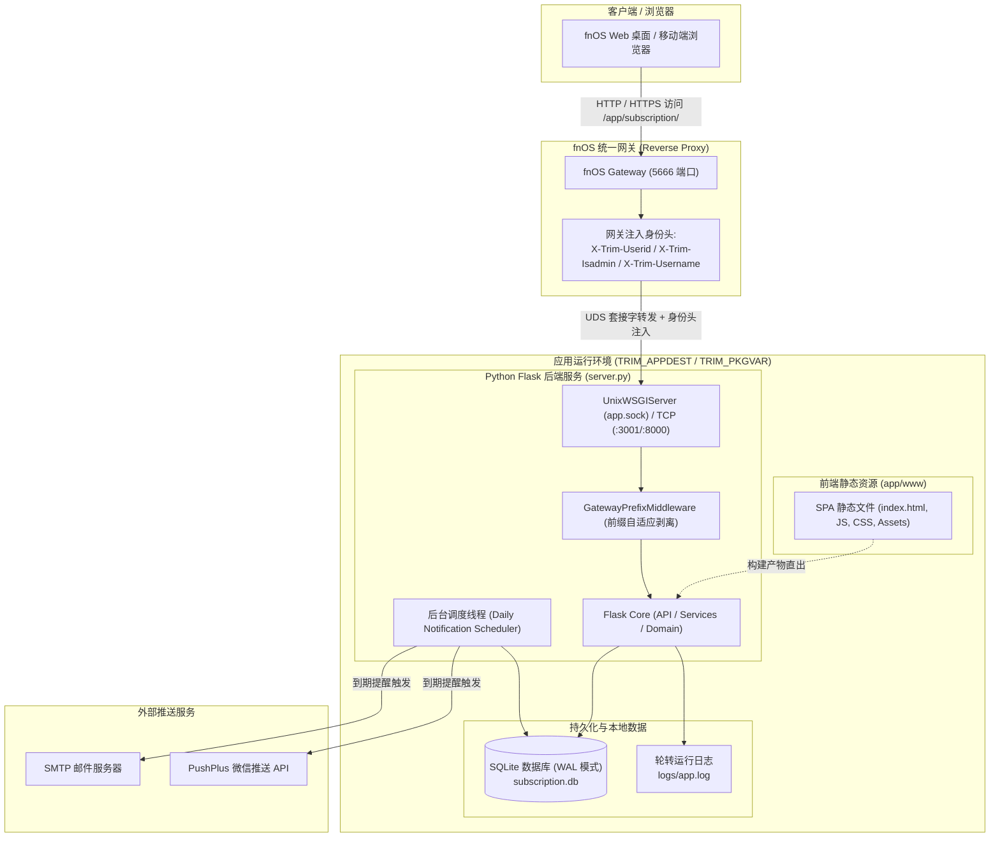
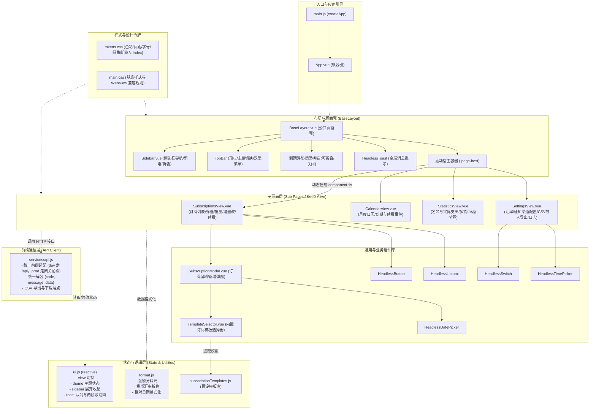
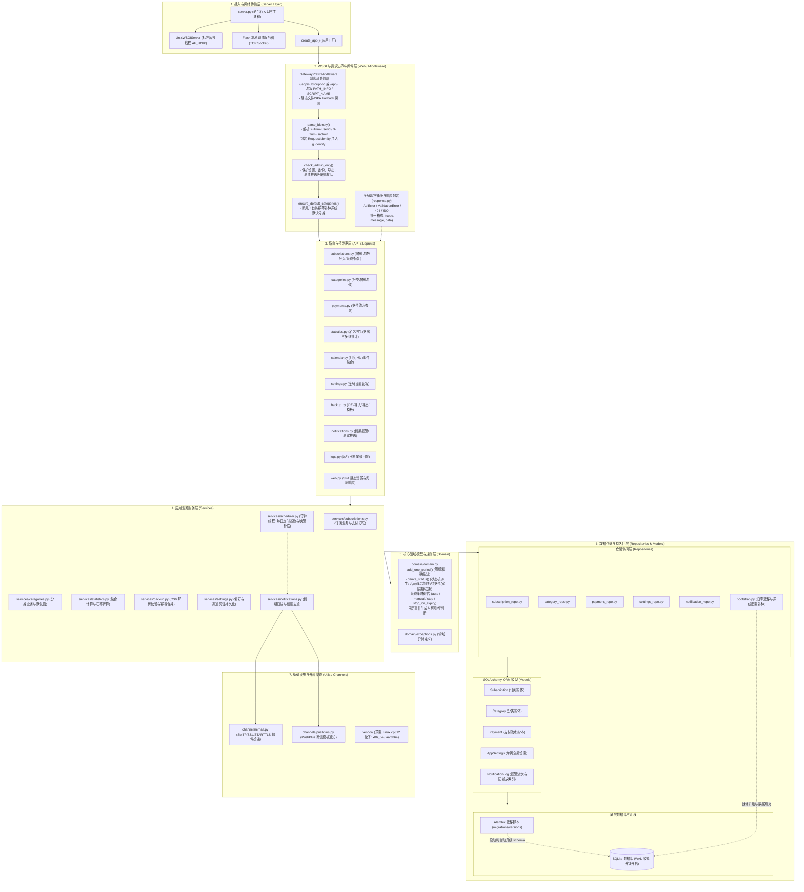
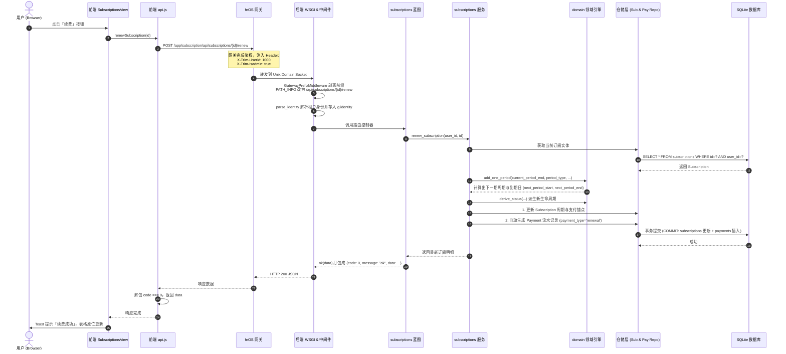
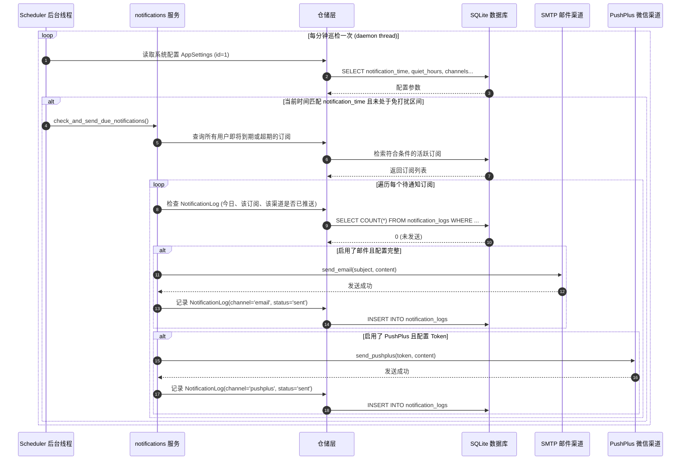
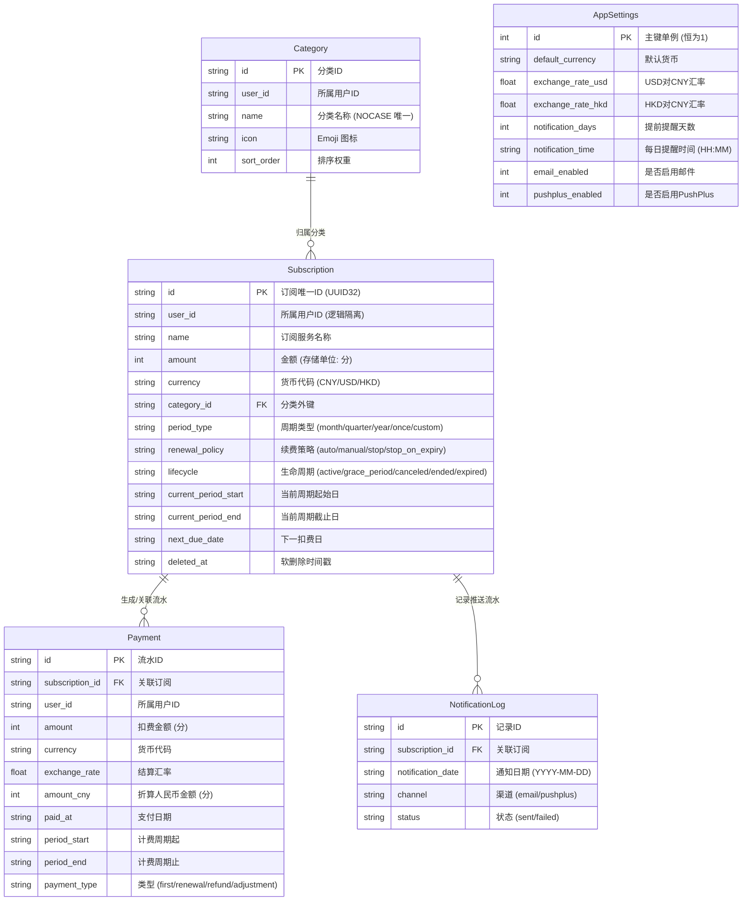

# 订阅管理 (zephyr-fn) 架构设计文档

本文档详细阐述了飞牛 fnOS 订阅管理应用（`zephyr-fn`）的前端与后端架构设计、通信机制、组件结构、数据流转与核心时序。

---

## 1. 系统总体拓扑与网络接入架构

应用作为飞牛 fnOS 容器生态内的第三方原生应用，依托飞牛统一网关实现鉴权与反向代理。

### 1.1 系统网络与进程拓扑图

### 1.2 接入与环境特性
- **双模监听支持**：生产环境通过 `--uds $TRIM_APPDEST/app.sock` 接收网关转发；本地开发通过 `--http 8000` 接收 TCP 直连请求。
- **租户隔离机制**：统一网关校验登录态后注入 `X-Trim-Userid`，后端服务全程依赖此 Header 实现多用户数据隔离。

---

## 2. 前端架构设计 (Vue 3 + Vite)

前端采用 **BaseLayout（公共页面壳）+ Sub Pages（子页面视图）** 体系，未使用重型路由库与中心化状态库，保证轻量、低内存占用与高响应性。

### 2.1 前端分层与组件架构图

### 2.2 前端核心机制
1. **视口隔离与滚动托管**：外层壳固定视口高度（`height: 100vh`），所有视图内容在 `.page-host` 内滚动，且滚动条自适应隐藏，彻底杜绝外层抖动与双滚动条。
2. **Keep-Alive 状态保活**：各子页面通过 `<component :is="...">` + `<keep-alive>` 保持状态，在日历切换月份或列表进行筛选时，切走再切回仍保留上下文。
3. **设计令牌化 (Design Tokens)**：颜色、间距、圆角与层级统一在 `tokens.css` 中声明 CSS 变量，支持浅色、深色及跟随系统自动切换。

---

## 3. 后端分层架构设计 (Python + Flask)

后端严格遵循经典的分层架构：WSGI 中间件层 $\to$ 路由层 $\to$ 服务层 $\to$ 领域层 $\to$ 仓储持久化层。

### 3.1 后端详细分层图

### 3.2 领域层关键规则
- **单一事实来源 (SSOT)**：以 `renewal_policy`（`auto` / `manual` / `stop` / `stop_on_expiry`）为唯一策略源，对外兼容只读派生字段 `auto_renew`。
- **状态派生机**：不持久化存储易变的状态（如即将到期），统一由 `derive_status(now, period_end, renewal_policy, billing_status)` 动态推导。
- **周期精确推进**：`add_one_period` 考虑月末锚定（如 1 月 31 日加 1 个月为 2 月 28/29 日，下月自动恢复 31 日）与闰年闰月计算。

---

## 4. 核心业务交互时序图

### 4.1 典型业务时序：订阅续费与流水落盘

### 4.2 后台巡检时序：到期检查与多渠道防重推送

---

## 5. 实体关系模型 (ER Diagram)

后端基于 SQLite WAL 模式运行，核心实体与外键关系如下：

---

## 6. 核心工程决策与亮点总结

| 维度 | 设计方案 | 解决的核心问题 |
| :--- | :--- | :--- |
| **网关路径自适应** | WSGI 层 `GatewayPrefixMiddleware` | 统一网关转发时原样保留 `/app/subscription` 前缀，中间件在 Flask 处理前自动重写 `PATH_INFO` 与 `SCRIPT_NAME`，同时兼容直接挂在 `/app` 下与本地 `/` 开发环境。 |
| **多租户安全隔离** | 基于网关头的全局用户会话 `g.identity` | 飞牛 NAS 为多用户系统，所有 CRUD 查询强制绑定 `user_id`，杜绝垂直与水平越权漏洞。 |
| **金额整数存储** | 数据库与后端全链路采用「分」作为整数类型 | 彻底消除浮点数在金额计算、汇率折算与账目累加过程中的精度丢失风险。 |
| **幂等补迁机制** | `bootstrap` 就地升级 + `Flask-Migrate` (Alembic) | 保证新装、旧版升级（从早期 SQLite 到带有 payments/deleted_at 的新表）平滑过渡，重启服务无缝兼容。 |
| **纯离线依赖打包** | `vendor/` 预置 cp312 manylinux 平台轮子 | 飞牛真机安装包不进行联网 `pip install`，避免设备无法连接 PyPI 导致的部署失败。 |
